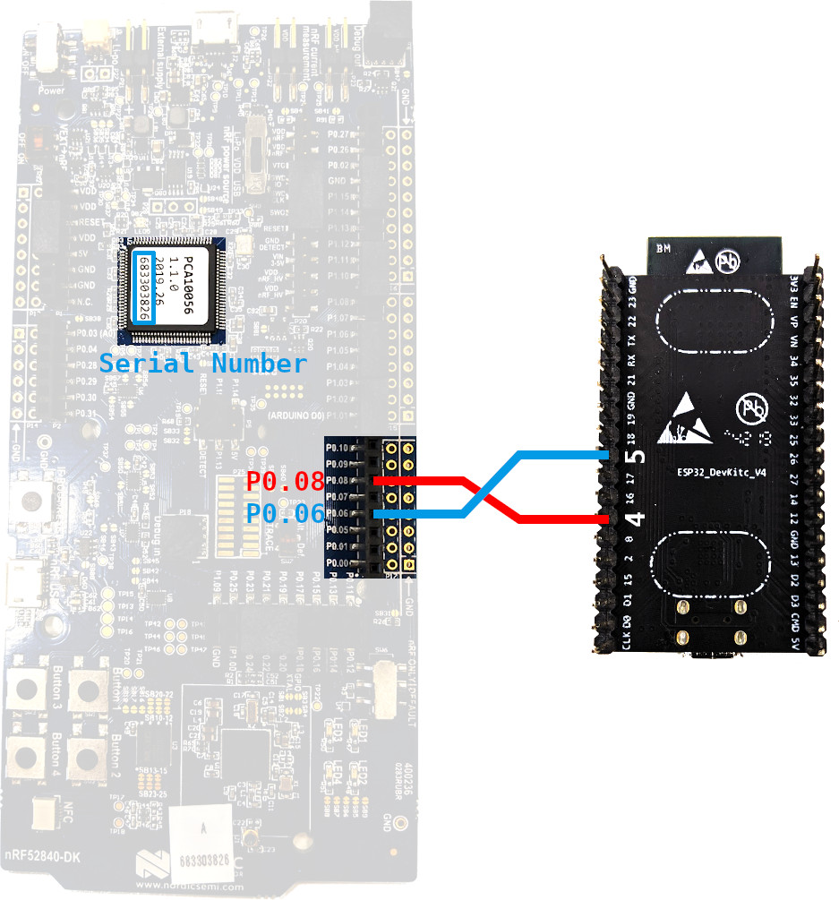

# Example CLI Application

The example CLI application runs the OpenThread stack on the [Espressif ESP32](https://www.espressif.com/en/products/socs/esp32/overview) and controls it with CLI commands through UART. OpenThread transmits and receives radio using a UART-connected [nRF52840 DK](https://www.nordicsemi.com/Products/Low-power-short-range-wireless/nRF52840).

## Platform

This example runs on Linux.

## Setup

### Setup ESP-IDF

Clone the [Espressif IoT Development Framework](https://github.com/espressif/esp-idf):

```shell
git clone --recurse-submodules -j6 --branch release/v3.3 git@github.com:espressif/esp-idf.git
./esp-idf/install.sh
```

Set up the environment:

```shell
export IDF_PATH=$HOME/esp-idf
source $IDF_PATH/export.sh
```

### Build and flash the CLI application

Connect the ESP32 board to the Linux host and execute:

```shell
cd example
make -j6
make flash
```

### Build and flash nRF52840 image

Connect the nRF52840 DK to the Linux host and execute:

```shell
cd third_party/openthread
./bootstrap
make -f examples/Makefile-nrf52840 CFLAGS="-DUART_HWFC_ENABLED=0"

cd output/nrf52840/bin
arm-none-eabi-objcopy -O ihex ot-rcp ot-rcp.hex

nrfjprog -f nrf52 -s 683704924 --chiperase --program ot-rcp.hex
```

Note: The Serial Number (for example, 683704924) is located in the center of the nRF52840 DK, as shown in the picture below.

### Connect devices

Connect the ESP32 board and the nRF52840 DK:

- ESP32.IO5 <---> nRF52840.P0.06
- ESP32.IO4 <---> nRF52840.P0.08



Ensure that the ESP32 board and the nRF52840 DK are powered by the same computer over USB or share a common ground by connecting a third wire, ex. ESP32 GND <---> nRF52840 GND.

## Run the CLI application

Connect to the ESP32 board from the Linux host:

```shell
make monitor
```

_Note: Dependending on your Linux distribution, the new line characters ('\r', '\n') may cause commands display issues. To have good look of the CLI, Connect the ESP32 board with advanced command `picocom -b 115200 /dev/ttyUSB0 --imap lfcrlf` (install `picocom` with `sudo apt-get install picocom`)._

The CLI application is now in interactive mode and waiting for commands, start the OpenThread stack to verify your setup:

```shell
> dataset init new
Done
> dataset
Active Timestamp: 1
Channel: 13
Channel Mask: 07fff800
Ext PAN ID: d63e8e3e495ebbc3
Mesh Local Prefix: fd3d:b50b:f96d:722d/64
Master Key: dfd34f0f05cad978ec4e32b0413038ff
Network Name: OpenThread-8f28
PAN ID: 0x8f28
PSKc: c23a76e98f1a6483639b1ac1271e2e27
Security Policy: 0, onrcb
Done
> dataset commit active
Done
> ifconfig up
Done
> thread start
Done
```
